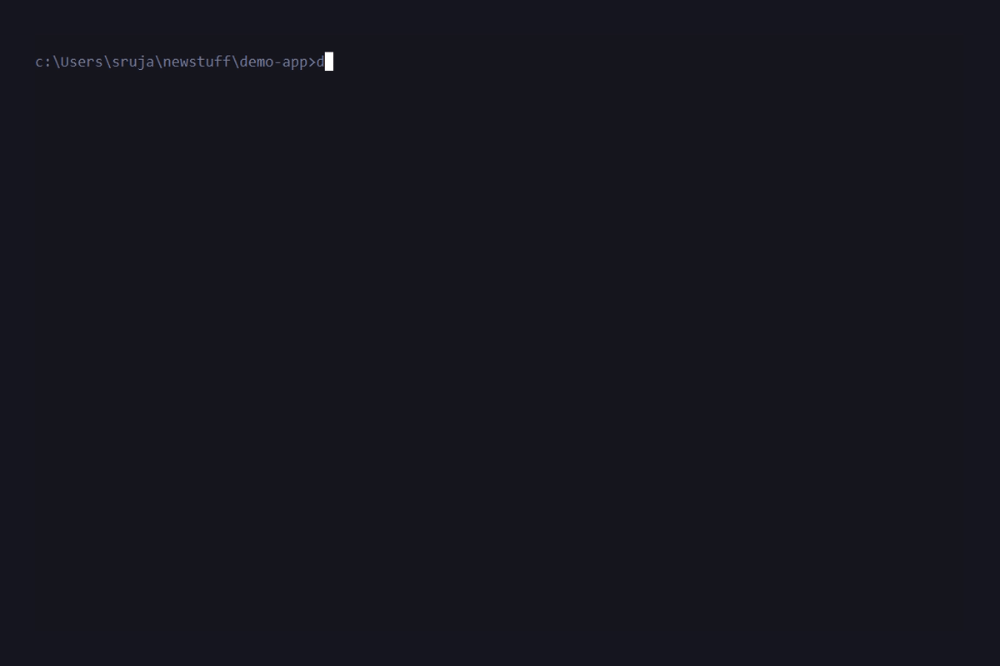

# 🐳 DockAgent


**DockAgent** is a zero-dependency Go CLI that doesn't just *guess* a Dockerfile for your project—it actively verifies and **self-heals** it.

Tired of copying a generated Dockerfile from an LLM, running `docker build`, getting a cryptic dependency error, and pasting it back into the chat? DockAgent automates that entire trial-and-error execution loop right in your terminal.

## ✨ Why DockAgent? (The Wedge)

There are a few AI build agents out there, but DockAgent is built specifically for minimal friction:
*   **Zero-Dependency Go Binary:** No massive Python environments, LangChain dependencies, or `numpy` installs. Just a single binary you can drop into any CI pipeline or local machine.
*   **No Vendor Lock-in or Extra Infra:** It runs entirely locally. No Docker accounts required, and no separate BuildKit servers to spin up. Just `docker build`.
*   **Self-Healing Loop:** Automatically executes the build. If it fails, it captures the raw `stderr`, feeds it back to the LLM, and patches the `Dockerfile` iteratively until it succeeds.

## 🚀 How it Works

The core architecture follows a deterministic Observe-Diagnose-Act loop:
1. **Analyze:** Scans your project directory (`package.json`, `go.mod`, `requirements.txt`) to understand your tech stack.
2. **Generate:** Uses an LLM to draft an initial, secure Dockerfile.
3. **Build:** Hooks directly into your local Docker daemon to test the build.
4. **Fix:** If the build fails, the error logs are fed back to the LLM for a targeted patch. The loop repeats until success.

<p align="center">
  
</p>

## 🛠️ Installation

```bash
# Install directly via Go
go install github.com/Abh-igyan/dock-agent@latest
```

Or build from source:
```bash
git clone https://github.com/Abh-igyan/dock-agent.git
cd dock-agent
go build -o dock-agent main.go
```

## 💻 Usage

DockAgent currently requires a Gemini API Key to function (Local LLM support coming soon!)

1. Set your API key:
   ```bash
   export GEMINI_API_KEY="your-api-key-here"
   ```
2. Run the agent in any project directory:
   ```bash
   dock-agent -dir /path/to/your/project
   ```

### Command Line Flags
- `-dir`: The directory you want to dockerize (default: `.`)
- `-retries`: The maximum number of times the agent should attempt to self-heal a broken build (default: `3`)

## 🤝 Alternatives

If DockAgent isn't quite what you're looking for, here are a few alternatives:
- **[Gordon (by Docker)](https://www.docker.com/blog/meet-gordon-dockers-ai-agent-for-your-entire-container-workflow/)**: Docker's official, proprietary AI agent. Great if you are deep in the Docker ecosystem and want human-approval gates.
- **[zbplan](https://github.com/zeabur/zbplan)**: A Go-based agent by Zeabur, but requires a reachable BuildKit server to function.
- **[Railpack](https://github.com/railwayapp/railpack) / Nixpacks**: Deterministic, zero-config builders without the LLM component. Excellent if you don't need tailored, readable Dockerfiles.

## 🤝 Contributing (We need you!)

DockAgent is an active project looking for community contributions! Check out our open issues, specifically:
- Integrating **Ollama / Local LLM** support for offline generation.
- Migrating from `os/exec` to the **Official Go Docker SDK**.
- Adding a **Run & Probe** step to ensure the container actually starts successfully post-build.
- Adding **Multi-Provider API** support (OpenAI, Anthropic).

See [CONTRIBUTING.md](CONTRIBUTING.md) (Coming soon) for more details!

## 📝 License
MIT License.
